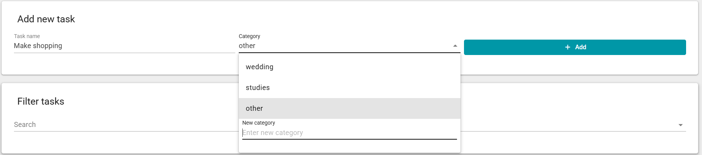
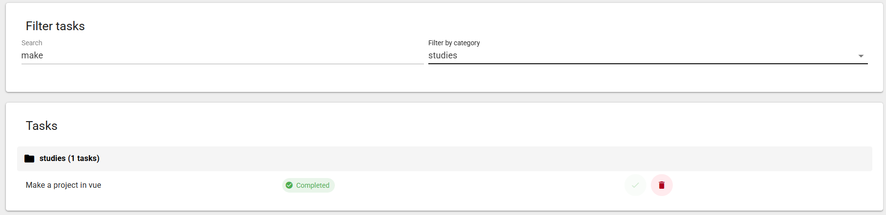
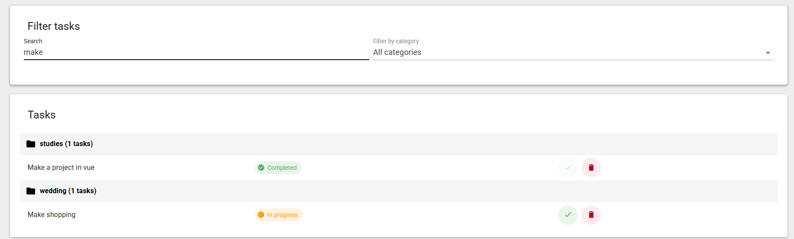
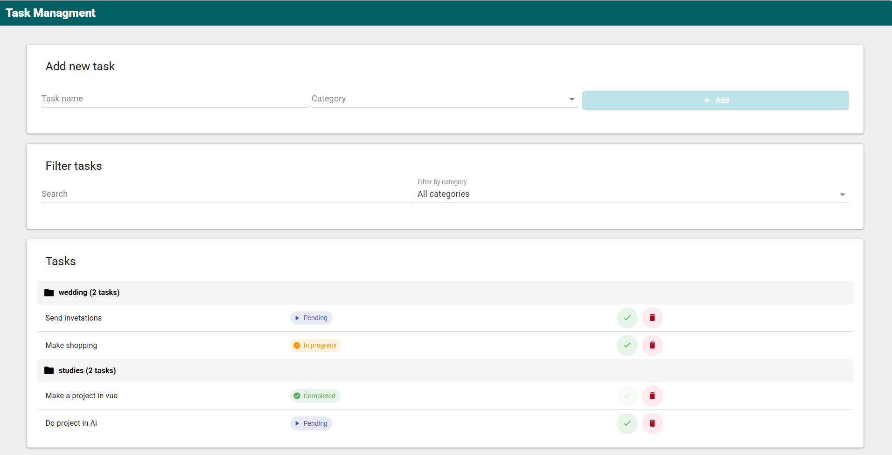

# Task Manager App

A clean and responsive task management interface built with Vue 3, Vuetify, and Pinia for creating, filtering, and updating task status with localStorage persistence.

## 🎬 Visual Demo

The project includes screenshots in `src/assets/` that show the main flows.

### Screenshots

| Flow | Preview |
| --- | --- |
| Adding a new task |  |
| Category filtering |  |
| Search filter |  |
| Full task view |  |

> 

## 🧱 Tech Stack

- Vue 3
- Vite
- Vuetify 4
- Pinia
- JavaScript (ES Modules)
- Sass / SCSS
- LocalStorage for browser persistence

## ✨ Features

- Add a new task with a title and category
- Display tasks grouped by category
- Filter tasks by category
- Search tasks by text
- Update task status between Pending, In progress, and Completed
- Delete tasks
- Automatically save the task list to localStorage

## 📦 Project Structure

- `src/main.js` — application entry point
- `src/App.vue` — root component
- `src/components/` — UI components
- `src/stores/TaskStore.js` — task logic and state management
- `src/assets/` — screenshots and media assets
- `public/` — static public files

## 🚀 Installation & Usage

1. Install dependencies:

```bash
npm install
```

2. Run the local development server:

```bash
npm run dev
```

3. Open the URL shown in the terminal in your browser.

## 🛠️ Build

```bash
npm run build
```

## 📌 Notes

- The app uses localStorage, so task data is persisted in the browser.
- No backend server is required.

## ⚡ Challenges & Lessons Learned

- Built a responsive UI with Vuetify that integrates cleanly with Vue 3 and Pinia.
- Centralized filtering and searching logic in the store to keep UI components focused on presentation.
- Learned how to use `localStorage` to preserve task state across page reloads.
- Focused on creating a simple and intuitive user experience for navigating categories and status updates.
